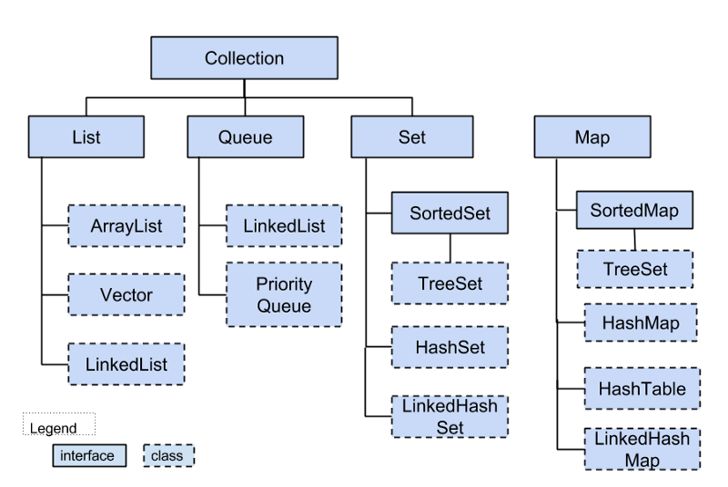

### ArrayList
ArrayList is the most commonly used List, it's implemented using array and it allows random access. Its shortcomings are:
 * if added a new element to an arraylist, the list may have to be expanded by trasfering all the data to another array(1.5 times size), it costs so much.
 * if added or removed an elememt in the middle, the list has to move half of the array, it costs so much.

